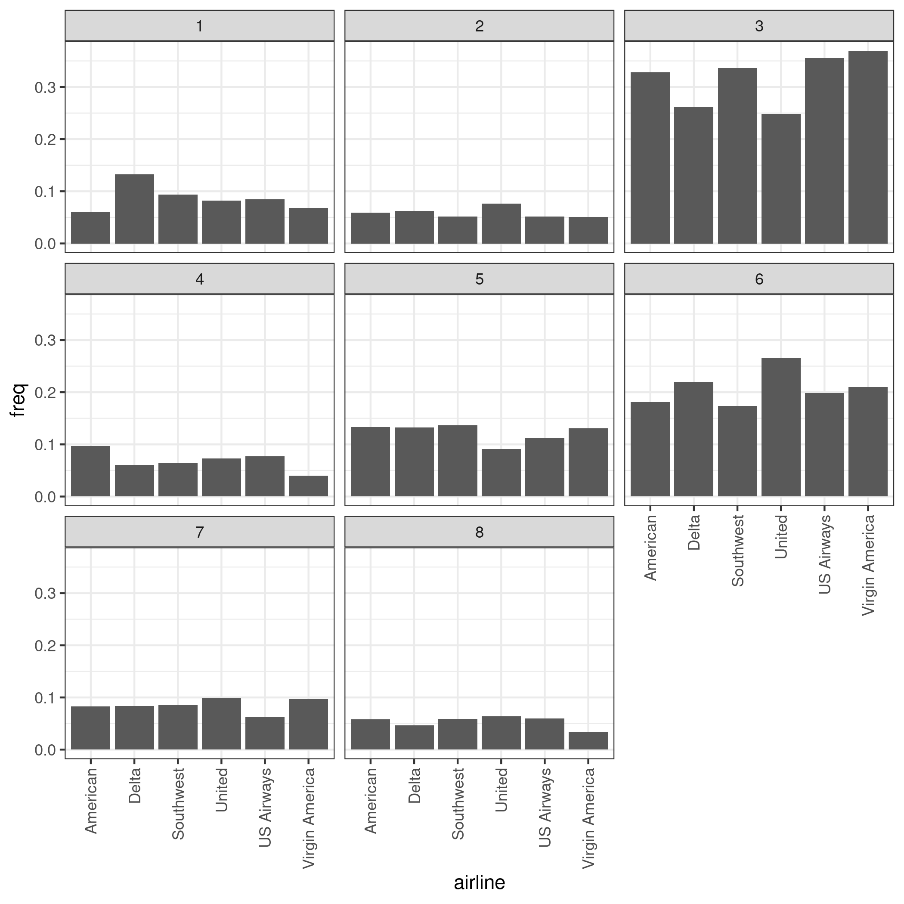

## Instructions

This group assignment is due on the **`r rmarkdown::metadata$duedate`** at **`r rmarkdown::metadata$duetime`**.

Solutions will be turned in via GitHub Classroom. **Only most recent commit on the main branch of the online GitHub repository when the assignment is due will be graded**. Your solution must use the `Rmarkdown` template provided in the assignment's repository that you cloned for this assignment. This means your answers will be compiled into a file called `assignment_answers.html` when you use the 'Knit' button in RStudio. Failure to follow these steps and submit `assignment_answers.html` in your GitHub repository along with the `assignment_answers.Rmd`, will result in a assignment grade of **zero**. Refer to the repository's `README.md` for instructions on how to complete the title and author fields for submission.

Each group needs to appoint a **group leader**. It is the group leader's job to "accept" the assignment via GitHub and then add all group members as collaborators to the group assignment. To do this, the group leader will need each member's GitHub username. The group leader can add group members as follows:

-   Go to their group assignment repository on GitHub
-   Click on the Settings tab
-   Go to 'Manage Access'
-   Click on 'Invite teams or people'
-   Enter the GitHub usernames of each group member, one by one, and give them 'Write' access
-   Click 'Add <username> to this repository'

Group members will then get an email to accept this invitation. Group members **must accept** this invitation to be able to view and contribute to the assignment.

To work on this assignment, first clone the GitHub repository to your machine, see the `README.md` for more details. After you have cloned the repository to your machine, the data for the assignment are available in the `data/` subdirectory. Open an RStudio session and use this folder as a project. Be sure to install all the necessary packages so that your solution document will run from start to finish.

Remember, your goal is to communicate. Full credit will be given only to the correct solution which is described and/or coded clearly. Convoluted and obtuse descriptions/code might receive low marks, even when they are correct. Aim for concise solutions, as it will save you time spent on write-ups, and also help you conceptualize the key ideas you are trying to express. Sentence limits often apply to questions that require written answers - stick to them (or under them) to get full credit.

## Text Analytics: Airline Complaints

This exercise studies airline complaints expressed on Twitter by using the text analytic tools you have used in class and labs. The content is not explicitly based on any published research, but drew inspiration from the article "[Exit, Tweets, and Loyalty](https://papers.ssrn.com/sol3/papers.cfm?abstract_id=2889388)" by Joshua Gans, Avi Goldfarb and Mara Lederman. You are encouraged to read the "Introduction" to help frame some of your answers.

The data for this exercise is located in `data/tweets.csv`. The tweets are a slightly cleaned up version of a "raw" set of tweets and include some additional variables that you can use in your analysis.

For this exercise you might need the following packages:

```{r, warning= FALSE, message=FALSE}
library(readr)
library(dplyr)
library(tibble)
library(tidyr)
library(stringr)
library(tidytext)
library(ggplot2)
library(tokenizers)
library(yardstick)
library(vader)
library(stm)
library(rlist)
```

### Perspective

Think of yourselves as marketing analysts working for United Airlines, a major US airline wanting to investigate tweets classified as "airline complaints" in February 2015 within the United States. Your goal is to derive managerially relevant insights from the data.

### Questions

1.  [5 points] Explain why consumers might use Twitter to express complaints about airlines. (max. 5 sentences)

*Twitter as a social media platform gives a voice to customers. It allows them to express either satisfaction or discontent with the service(s) they have experienced. Via Twitter customers can share their opinions with the community but also to the airlines themselves, with the main objective to provide feedback on service quality.*

2.  [1 point] Load the data for the exercise and name it `tweets`.[^1]

[^1]: When you load the data into `R` you might get 'parsing failures', where R struggles to read in certain lines. This is OK, ignore these and continue. The loaded data should contain 14,640 rows.

```{r}
# Load dataset
tweets<- read_csv('data/tweets.csv', show_col_types = FALSE)
```

The first step you need to perform is to clean up the text as it includes a lot of unnecessary tokens such as links, mentions and numbers. The code to clean up the text is provided below. Uncomment the code to proceed further.

```{r}
 tweets_cleaned <-
   tweets %>%
   mutate(
         # remove links
         text = str_remove_all(text, "https\\S*"),
         text = str_remove_all(text, "http\\S*"),
         text = str_remove_all(text, "t.co*"),
        # remove mentions
          text = str_remove_all(text, "@\\S*"),
#         # remove annoying html stuff
          text = str_remove_all(text, "amp"),
          text = str_remove_all(text, "&S*"),
          text = str_replace_all(text, "&#x27;|&quot;|&#x2F;", "'"), # is this replacement meant to have "'" an extra comma?
          text = str_replace_all(text, "<a(.*?)>", " "),
          text = str_replace_all(text, "&gt;|&lt;|&amp;", " "),
          text = str_replace_all(text, "&#[:digit:]+;", " "),
          text = str_remove_all(text, "<[^>]*>"),
         # remove numbers
           text = str_remove_all(text, "[:digit:]"),
         # remove excess whitespace
           text = str_squish(text),
           text = str_trim(text)
          )
```

3.  [1 point] Drop all tweets that have less than three words.

```{r}
# tokenize, count words per tweet ID and keep only those with length more than 2 words
tweets_tokenized <- tweets_cleaned %>% 
  unnest_tokens(word, text) %>% 
  group_by(tweet_id) %>%
  count(sort= TRUE) %>% filter(n > 2)

length(unique(tweets_tokenized$tweet_id))

#filtering only those tweets with length > 2
tweets_cleaned <- tweets_cleaned %>% 
  filter(tweet_id %in% tweets_tokenized$tweet_id)

#NOTE: there are retweets so tweet ID is not unique in the original dataset
```

4.  [2 points] Create a bar plot that displays the number of tweets in the dataset per airline.

```{r}
# Summarizing number of tweets per airline
tweets_cleaned %>%
  group_by(airline) %>% 
  count(sort = TRUE) %>%
  ggplot(aes(x = reorder(airline, n), y = n, fill = n)) +
  scale_fill_continuous(low = "lightblue", high = "darkblue") +
  geom_col() + 
  ylab('# Tweets') + 
  xlab('Airline') +
  theme_bw() +
  coord_flip() +
  theme(legend.position = "none")

```

5.  [5 points] Use your answer to (4) to describe any differences in the frequency of tweets posted for different airlines. Does this suggest some airlines are better than others at customer service? (max. 5 sentences)

*The difference of frequency of tweets might be related to the quality of their service although we cannot make that assumption without taking into account other factors. In the paper it says higher market share leads to more complaints, however we don't know how bad the complaints are without a sentiment analysis, so we can't really decide that the most tweets is the best airline.*

6.  [1 point] Reduce the size of the dataframe so that only `airline`, `airline_sentiment` and `text` remain as columns. Add a column `id` that uses an observation's row number to give each tweet a unique id.

```{r}
# select only relevant columns
tweets_cleaned <- tweets_cleaned %>% 
  select(airline, airline_sentiment, text) %>% 
  mutate (tweet_id = row_number())

```

Your manager proposes using a sentiment lexicon to classify tweets as positive, negative or neutral (he doesn't know this classification already exists in the data). Based on what they have heard from another analyst in your company he recommends the VADER lexicon.

7.  [5 points] What is a sentiment lexicon and how does it classify tweets as positive, negative, or neutral? Why would this classification be useful? (max. 5 sentences)

*Sentiment lexicons are dictionaries used to evaluate opinions and detect emotions in text. They use human based polarity evaluations to classify the words. It could be useful to do text analysis in a quantitative way.*

8.  [5 points] Why might your manager have suggested VADER? (max. 5 sentences)

*Because it is a valence-based lexicon and unlike the polarity based lexicons, it also includes the intensity of the words exist. The valence based lexicon enables to capture the nuances between the words, taking into account of 'how good or bad' the word is. It also distinguishes between "amazing" and "nice", and found to perform the best in social media text analysis. (Hutto and Gilbert, 2014)*

9.  [5 points] Use the VADER lexicon to classify tweets as positive, negative or neutral.[^2]

[^2]: You might find some rows of data return `ERROR` as their output. Filter these out of what follows.

```{r}
#run vader on tweets dataset
vader_sents <- vader_df(tweets_cleaned$text)

#add vader sentiment column based on thresholds
vader_sents <- vader_sents %>% 
  mutate(vader_out = case_when(compound > 0.05~"positive", 
                               compound < 0.05 ~ "negative", 
                               .default = "neutral")) %>% 
  rowid_to_column("tweet_id") %>% 
  select(tweet_id, vader_out)


```

10. [2 points] Merge this sentiment classification with the existing data from (6).

```{r}
tweets_cleaned <- tweets_cleaned %>% 
  left_join(vader_sents) %>% 
  mutate(vader_out = as.factor(vader_out))
```

The data you originally had access already had a classification of tweets into positive, negative and neutral in the column `airline_sentiment`. You will want to compare the VADER output to this classification.

11. [5 points] What is a confusion matrix? Why can it be used to assess the performance of VADER relative to the existing classification? (max. 5 sentences)

*A confusion matrix is a table that compares a model's predictions to the actual classifications. It reveals how often VADER correctly identifies sentiment (positive, negative) compared to the existing system, highlighting strengths and weaknesses in correctly classifying sentiment.*

12. [2 points] Compute the confusion matrix by comparing `airline_sentiment` to VADER's predictions.

```{r}

confusion_matrix <- table(Predicted = tweets_cleaned$vader_out,
                          Actual = tweets_cleaned$airline_sentiment)

confusion_matrix

```

13. [2 points] Compute the accuracy of VADER's predictions compared to `airline_sentiment`.

```{r}

correct_predictions <- sum(diag(confusion_matrix))

total_predictions <- sum(confusion_matrix)

#calculate accuracy
accuracy <- correct_predictions / total_predictions


print(paste('VADER accuracy is: ', accuracy))

```

14. [5 points] Summarize your findings for the manager. Would you recommend using a pre-canned sentiment lexicon such a VADER for dealing with complaints data based on your findings? (max. 5 sentences)

*According to our confusion matrix, VADER performs at a 54% accuracy. So it is a bit better than 50 percent, but the margin is quite small. For the negative predictions, it had a 90% rate for negative [sensitivity: TP / (TP + FN)], but for positive, it has 45% prediction rate [specificity: TN / (TN + FP)].*

After seeing the results above, your manager sets you a new task: He wants to know what topics people discuss in negative tweets and how the airline you work for compares to the rest of the industry. Your manager assigned you his best text modeler, who was put to work overnight to produce a first draft of a topic model. The topic model is saved as `data/complaints_topics.Rds` and can be loaded using the `list.load()` function.

15 [1 point]. Load the topic model from file into `R`.

```{r}
# load topics
 topics<- list.load('data/complaints_topics.Rds')
```

16. [4 points] How many topics are in the estimated model? Use the output of the `labelTopics()` command to help you assign each topic a 'label' describing what it represents.

```{r}
# There are 8 Topics 
labelTopics(topics)

#---- Assign Topic labels ----
#Topic 1: In-flight service
#Topic 2: Weather related issues 
#Topic 3: Phone booking service
#Topic 4: Staff service
#Topic 5: Flight cancellations & delays
#Topic 6: Missing luggage
#Topic 7: Passenger claims & refunds
#Topic 8: Customer agent service
 
```

17. [5 points] Are the topics above relatively distinct from each other? Are there managerial implications for each topic? Explain. (max 5 sentences)

*Indeed we can see that for each topic there are different aspects of the airline services which customers are complaining or reviewing.*

The text modeler also assigned each negative tweet its most probable topic from the model they estimated. The resulting data set is saved as `data/complaint_tweets.csv`.

18. [4 points] Load the data & produce a graph that shows the proportion of tweets for each airline in each topic. Your final graph might resemble the one below, but should have meaningful plot labels rather than 1, 2, 3 and so on:

```{r, echo = FALSE, out.width="65%", fig.align='center'}

```

```{r}
# load complaints with most probable topic
complaint_tweets<-read_csv('data/complaint_tweets.csv')

#join df
complaint_tweets <- complaint_tweets %>%  
  mutate(topic_name = case_when(
    topic == 1 ~ 'In-flight service',
    topic == 2 ~ 'Weather related issues',
    topic == 3 ~ 'Phone booking service',
    topic == 4 ~ 'Staff service',
    topic == 5 ~ 'Flight cancellations & delays',
    topic == 6 ~ 'Missing luggage',
    topic == 7 ~ 'Passenger claims & refunds',
    topic == 8 ~ 'Customer agent service',
    .default = 'Other'
  ))

tweet_proportion <- complaint_tweets %>%
  group_by(airline, topic_name) %>%
  summarise(number_tweets = n()) %>%
  mutate(tweet_proportion = number_tweets / sum(number_tweets))

ggplot(tweet_proportion, aes(x = airline, y = tweet_proportion, fill = as.factor(topic_name))) +
  geom_bar(stat = "identity", position = "dodge") +
  scale_fill_grey(start = 0.2, end = 0.8) +
  labs(x = "Airline", y = "Proportion of Tweets", fill = "Topic") +
  ggtitle("Proportion of Tweets by Airline and their Corresponding Topic") +
  theme_minimal() +
  theme(axis.text.x = element_text(angle = 45, hjust = 1)) + 
  facet_wrap(~ topic_name)
```

19. [5 points] Explain the relevant findings you would want to report to your manager (a United Airlines employee) from this graph. (max. 5 sentences)

*According to the mapped tweets the most common topics in the US airline industry are related to (a)Phone booking service, (b) Missing luggage claims and (c) Flight cancellation & delays, in the mentioned order. This can be interpreted as this are areas to improve based on customers' experiences. An actionable insight could be to evaluate current phone booking process to find specific improvements needed or bottlenecks to fix.*

20. [5 points] Using the results from above propose a new strategy that United Airlines could adopt in the short run to make it more competitive than their competition in terms of dealing with complaints. (max. 5 sentences)

*Taking a closer look at Missing luggage complaints United Airlines leads the trail, meaning there are probably having issues with logistics on passengers' luggage. A first approach would be to evaluate if the issues is more common in certain airports or routes, this could be the case in overcrowded airports or frequent destinations. Other possible improvement for the missing luggage complaints, United Airlines could use their refund service as an advantage to refund lost luggage to differentiate from other airlines. However it is worth considering possible additional costs to this idea*
